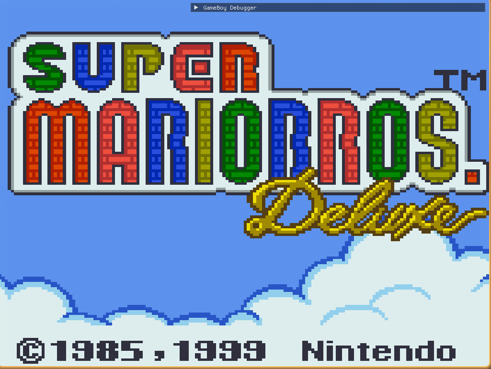
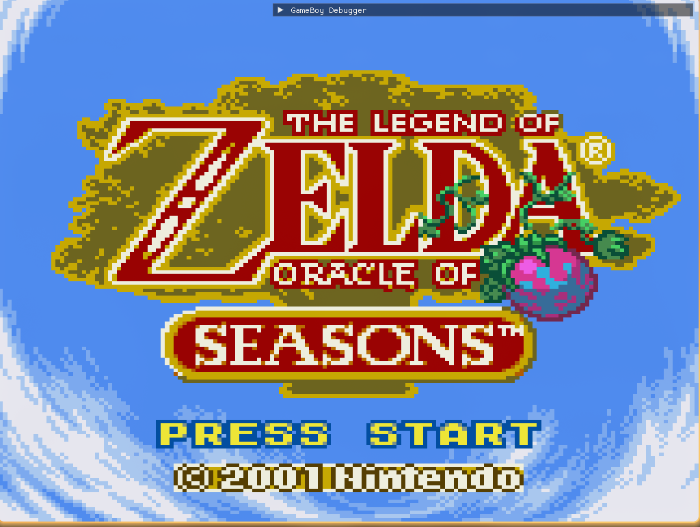
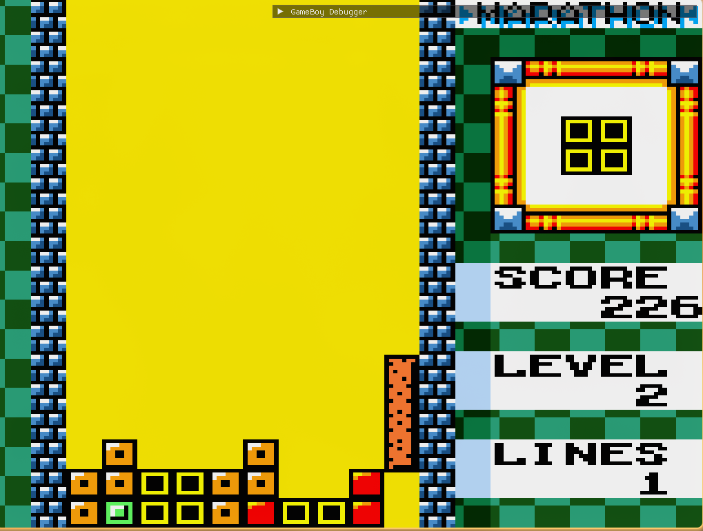

# GameBoy

A compact Game Boy / Game Boy Color emulator project (development workspace).

**Quick overview:** builds with CMake, runs a local executable `GameBoy` in the `build/` folder and loads ROM files from the `rom/` directory. Save files are stored in the `saveFiles/` directory.

**Prerequisites**

- CMake (>= 3.10) and a C++ toolchain (g++, clang++)
- SDL2 development libraries (or the platform equivalents used by the project)
- Git (optional)

**Build (Release)**

1. Create and enter a build directory:

```bash
mkdir -p build && cd build
cmake .. -DCMAKE_BUILD_TYPE=Release
cmake --build . -- -j$(nproc)
```

**Build (Debug)**

```bash
mkdir -p build-debug && cd build-debug
cmake .. -DCMAKE_BUILD_TYPE=Debug
cmake --build . -- -j$(nproc)
```

**Run**

- From the workspace root (example):

```bash
./build/GameBoy <path/to/rom.gb> --default|--debug
```

- If you built in `build-debug` then run `./build-debug/GameBoy <path/to/rom.gb> --default|--debug`.
- The program expects two arguments: a ROM path and a mode flag. Use `--default` for the normal build path (no debug overlay) or `--debug` (or any non-`--default` string) to enable the ImGui debug view. Note: the current code treats any second argument that is not exactly `--default` as debug mode.
- ROMs: place ROM files inside the `rom/` subfolders or pass an absolute path.
- Save files are written to `saveFiles/`.

**Configuration & Keymap**

- Key mappings are loaded from a single plain-text file named `gameboy_gamePad.config` in the working directory. The loader is implemented in `src/Platform/Platform.cpp` and expects lines of the form `BUTTON = SDL_ScancodeName` (for example `A = J`). If the file cannot be opened a built-in default mapping is used.
- To change the default mapping, edit or create `gameboy_gamePad.config` next to the executable. The supported button names are: `RIGHT`, `LEFT`, `UP`, `DOWN`, `A`, `B`, `SELECT`, `START`.
- There is no runtime settings persistence for video/audio/keymap beyond the `imgui.ini` used by ImGui; the project does not currently support a general `config.ini` or JSON settings file.

Recommended default key mapping shipped in source (used when `gameboy_gamePad.config` is missing):

- D-Pad: `D` (Right), `A` (Left), `W` (Up), `S` (Down)
- A: `J`
- B: `K`
- Start: `I`
- Select: `U`

If you want a UI for remapping keys or persistent config files, that feature is not yet implemented; creating a `gameboy_gamePad.config` file is the supported workflow.

**Developer notes**

- Source entry: [src/main.cpp](src/main.cpp)
- Platform-specific helpers: [src/Platform](src/Platform)
- ImGui files are in the `imgui/` folder for reference and integration.

**Working demo**
**Working demo**

Click an image to view the full screenshot (these are stored in `readMePngs/`).







**Missing / Not implemented features (compared to mature emulators such as SameBoy or commercial releases)**

- Link cable / multiplayer emulation (no local or networked link support).
- Save states and instant rewind functionality.
- Super Game Boy (SGB) special features and SGB border/effects support.
- Full accuracy features (cycle-exact timing, advanced APU quirks) that mature emulators implement for perfect audio/video compatibility.
- Built-in GUI for remapping keys — only file-based mapping via `gameboy_gamePad.config` is supported.
- A robust command-line flag parser; currently the program expects exactly two arguments and treats any non-`--default` second argument as debug mode.

This list is intentionally conservative; the emulator implements many core features (CPU, PPU, common MBCs and at least basic RTC handling), but lacks many convenience, compatibility, and polishing features found in long-lived projects.

**Troubleshooting**

- If CMake cannot find SDL2, install the SDL2 dev package for your distro (e.g., `libsdl2-dev` on Debian/Ubuntu) or set `CMAKE_PREFIX_PATH` to your SDL installation.
- If build fails, inspect `CMakeFiles/CMakeError.log` and `CMakeFiles/CMakeOutput.log` in your `build/` folder.
